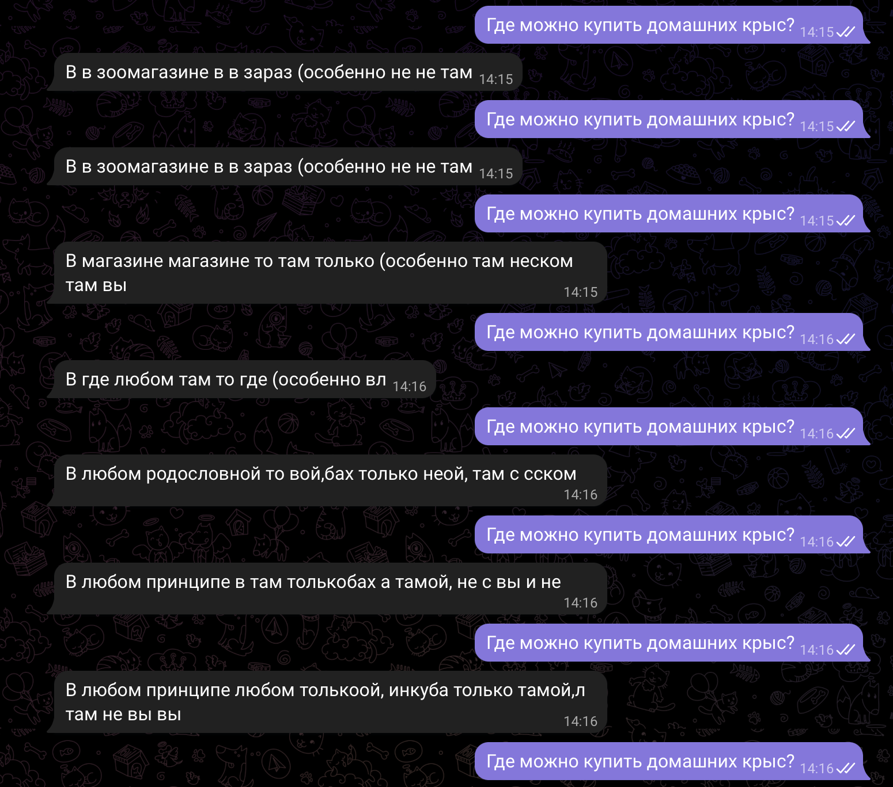

# generative-chitchat

## Токенизатор и предобработка
BPE train.ipynb – тренировка токенизатора

Data preparation.ipynb – предобработка данных

## Запуск
Запуск обучения из main.py

## Инференс
Для инференса запустить inference.py, реализован алгоритм beam search и top-k

## Телеграм-бот
Для запуска использовать telegram_bot.py

# Примеры генерации

